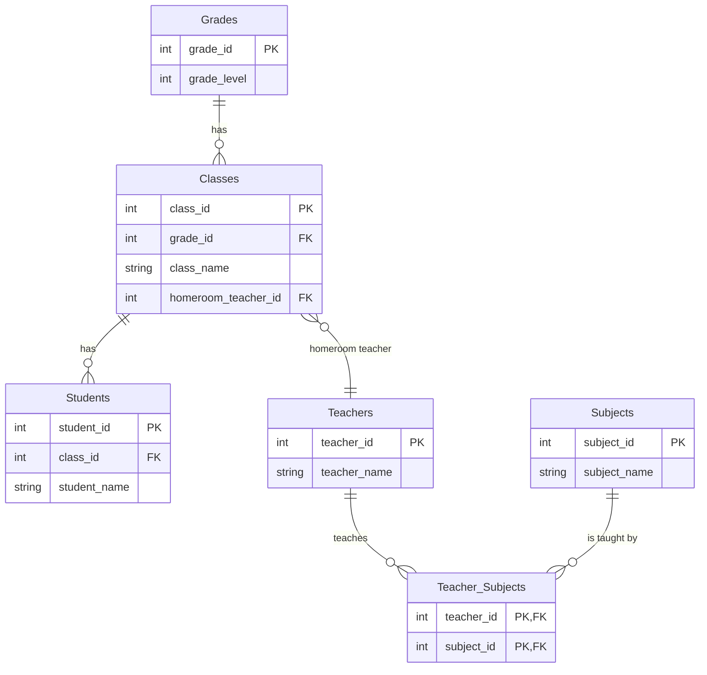
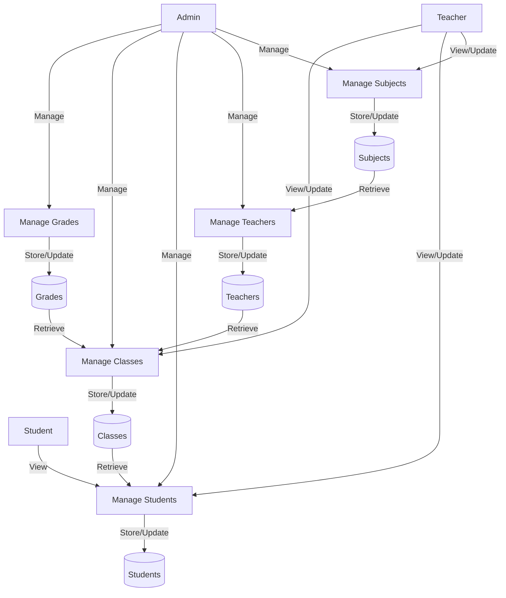
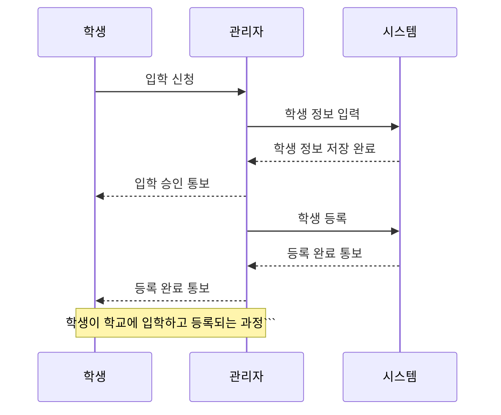

## 시나리오 
학교 시스템을 DB로 만들고 싶습니다. 
학년은 총 1학년부터 6학년까지 있으며 한 반에 학생은 30명이 있습니다.  한 학년당 반의 수는 조금씩 다르지만 4~6개 정도가 있습니다. 각 반에는 선생님이 담임 선생님으로 있으며 선생님들은 각 주요과목을 하나씩 담당하고 있습니다. 이 학교에서 다루는 주요 과목은 "수학" "국어" "영어" "체육" "음악" "과학" "사회" "도덕" 입니다. 

## ERD 

## DFD 

## Sequence Diagram 

